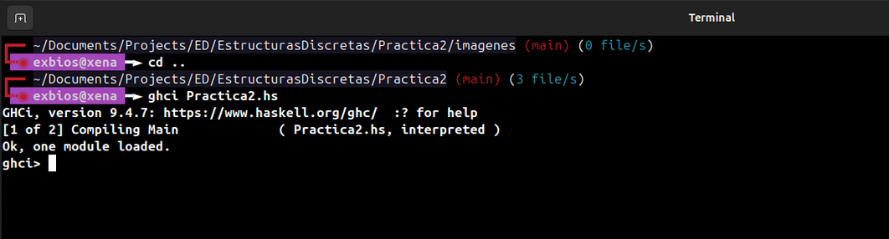

## Objetivo de la practica
Trabajar con los conceptos basico de haskell, como listas, funciones, recursio, tipos (Int, Float, Bool, etc) además de como importar modulos como el Data.Bits

## Tiempo requerido en realizar la práctica completa
Para esta practica tuve que leer un poco más como funciona haskell a nivel de funciones, por ejemplo al llamado pattern matching una funcion puede indicar por decirlo así como va a recivir sus argumentos ejemplo: suma :: [Int] -> Int, en ese caso toma una lista de Ints pero podemos dejarlo a que solo reciva 3 enteros podria ser sumaListaDeTres [1, 2, 3] y la función seria: sumaListaDeTres (a:b:c:[]) aqui le indicamos a haskell que solo recivimos 3 enteros y no más y podemos regresar a+b+c.
En total me tomó como 4 horas poder realizar todos los ejercicios incluido el extra.

## Comentarios
Creo que no tuve mayores problemas que no saber como funcionan el pattern matching en la funciones, porque intuí que podria ser como
sumaListaDeTres [a:b:c:[]] pero para hasjell eso es [[Int]] y pues eso me confundio al comienzo, pero después si lo piensas bien tiene sentido, porque una cosa es una lista y los "argumentos" de la función. Para el problea de `esDescendiente` fue el que más me costo porque no se me ocurrio como hacer la recursión pero al final salio :P, el resto no fue tan complicado, ya que para el del par usando bitwise hace tiempo a habia leído como algunos programas en bajo nivel usa bitwise para ser más optimos.

## Salida de GHCI al cargar un archivo

