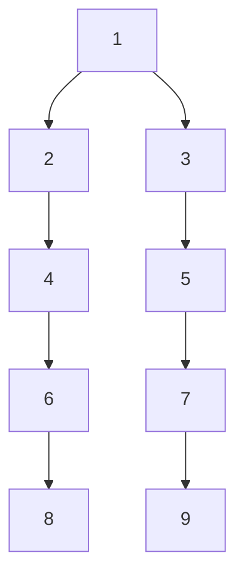
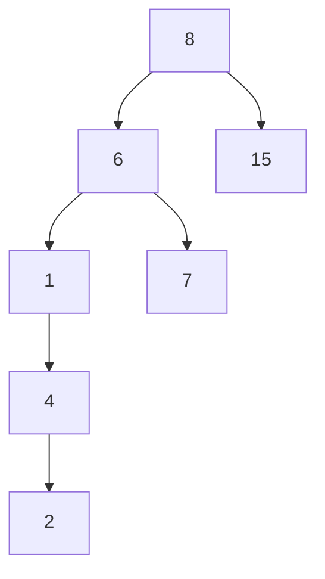
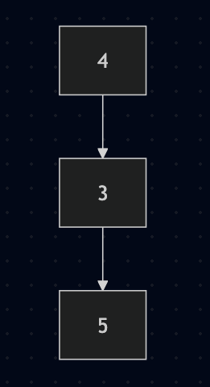
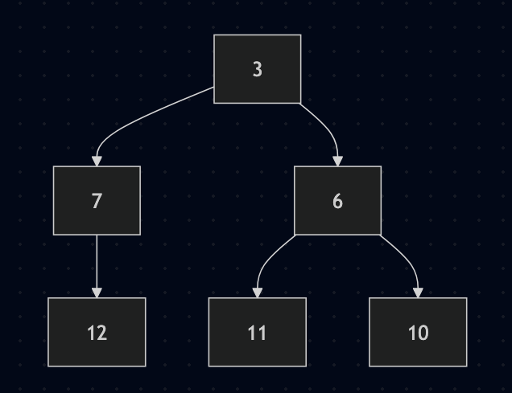
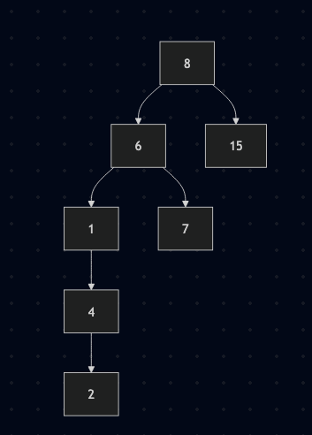

## Objetivo de la practica
En esta práctica 6 enfocado en arboles y recursion

## Tiempo requerido en realizar la práctica completa

## Comentarios

## Actividades

### 1. Basandote en el tipo de dato Arbol construye las representaciones gráficas de dos

árboles binarios, cada árbol debe tener entre 3 y 5 niveles. Estas representaciones debes adjuntarlas en tu respectivo README.md usando la sintaxis para generar árboles de la herramienta Mermaid.

Arbol 1

Arbol 2

### Crear la representación visual de los siguientes árboles (adjuntalo en tu README)

a) AB 4 Vacio (AB 3 Vacio (AB 5 Vacio Vacio))

b) AB 3 (AB 7 (AB 12 Vacio Vacio) Vacio) (AB 6 (AB 11 Vacio Vacio) (AB
10 Vacio Vacio))

c) AB 8 (AB 6 (AB 1 Vacio (AB 4 (AB 2 Vacio Vacio) Vacio)) (AB 7 Vacio
Vacio)) (AB 15 Vacio Vacio)

B
oooo
B

practica6_test.hs:45:80: error:
    Data constructor not in scope: InOrden :: TipoDeOrden
    Suggested fix: Perhaps use ‘InOrder’ (imported from Practica6)
   |
45 |     [ "InOrden traversal"  ~: [1, 3, 4, 5, 6, 7] ~=? recorrido arbolBalanceado InOrden
   |                                                                                ^^^^^^^

practica6_test.hs:46:80: error:
    Data constructor not in scope: PreOrden :: TipoDeOrden
    Suggested fix: Perhaps use ‘PreOrder’ (imported from Practica6)
   |
46 |     , "PreOrden traversal" ~: [5, 3, 1, 4, 7, 6] ~=? recorrido arbolBalanceado PreOrden
   |                                                                                ^^^^^^^^

practica6_test.hs:47:80: error:
    Data constructor not in scope: PosOrden :: TipoDeOrden
    Suggested fix: Perhaps use ‘PostOrder’ (imported from Practica6)
   |
47 |     , "PosOrden traversal" ~: [1, 4, 3, 6, 7, 5] ~=? recorrido arbolBalanceado PosOrden

